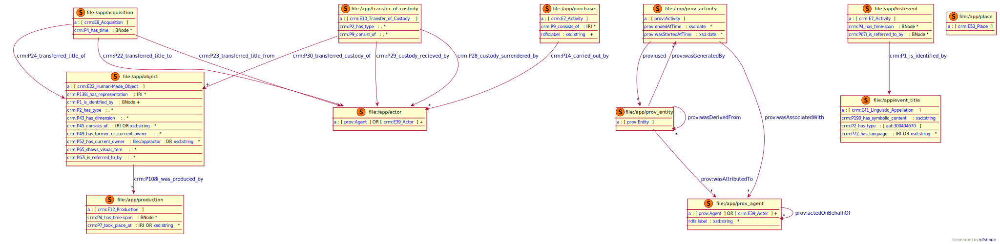

# Provenance Data Modelling 

**This folder contains the following:**
<ol>
    <li> TriG for objects <a href="https://hdl.handle.net/20.500.11840/686332">rv-1148-1<a> and <a href="ttps://hdl.handle.net/20.500.11840/829286">rv-2584-169a<a> 
    <li> Also Turtle file for the object objects (Removed the named graph from the TriG file; My ShEX validator do not support RDF-Named Graph at this moment)
    <li> ShEX shape for provenance data model(<a href="validator.shex">validator<a>)
    <li> Shapemap query can be found in <a href="shapemap_query.txt">shapemap file<a>
</ol>

Validation tool: <a href="https://rdfshape.weso.es/shexValidate ">RDFshape<a>

## The Data Model

