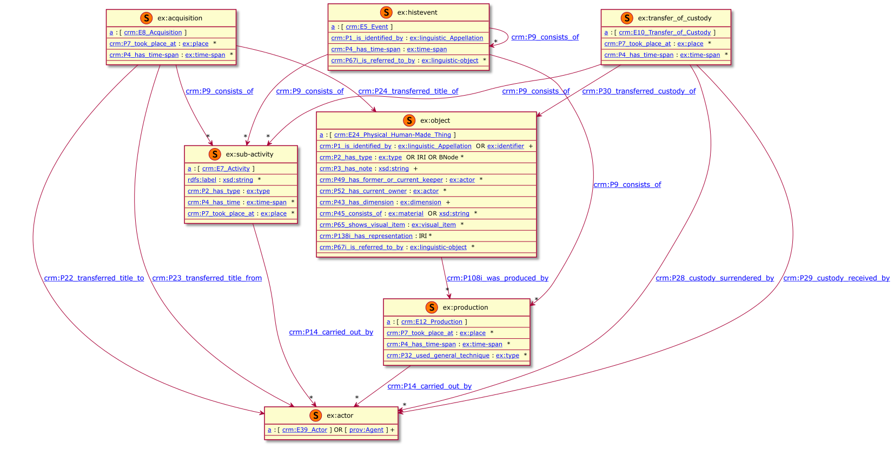
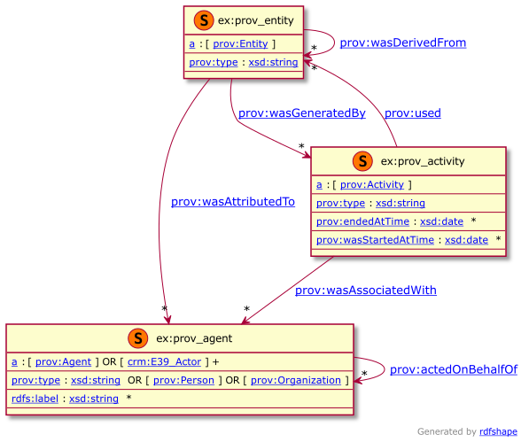

# Ethnographic Object Provenance Data Modelling 

**This REPO contains the following:**
<ol>
    <li> <a href="/data">Data TriG files<a>
    <li> <a href="/ontologies">Existing ontologies:<a> CIDOC & PROV
    <li> <a href="/resource">Resources:<a> Interview questions, Model diagrams, Data Diagrams 
    <li> <a href="validator.shex">ShEX shape<a> for data model
    <li> <a href="shapemap_query.txt">Shapemap query<a> can be found in a text file
    <li> <a href="validation_sparql.txt">SPARQL Queries<a> against CQs
</ol>

Validation tool: <a href="https://rdfshape.weso.es/shexValidate">RDFshape<a>

## The Data Model

### Object Description Ontology

### Object Provenace Ontology

### Data Provenace Ontology

### Multi-perspective Ontoloy
